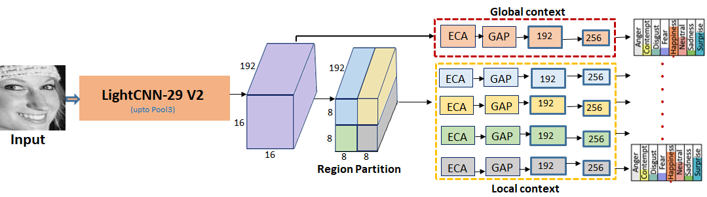
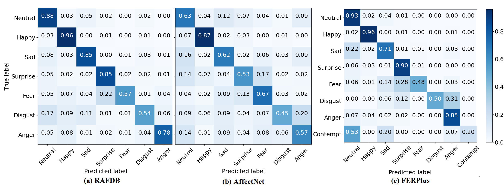

# CFERNet

<strong> CERN: Compact Facial Expression Recognition Net</strong> 

Pipeline of CERN Architecture. Input is a gray scale face image. Features from base model (LightCNN29 V2) pass through attention based global context branch as well as spatially partitioned into four local regions which go through
independent local context branch. Each of local and global context goes through
independent expression classifier. Note that ECA is Efficient Channel Attention,
GAP stands for global average pooling and LightCNN29 V2 is version 2 of lightcnn29
model. See https://github.com/AlfredXiangWu/LightCNN for details. (Best viewed
in color).

Confusion plots for in-the-wild datasets using CERN model are shown below:

Contact:
darshangera@sssihl.edu.in

Acknowledgments:
We dedicate this work to Bhagawan Sri Sathya Sai Baba, Divine Founder Chancellor of Sri Sathya Sai Institute of Higher Learning, PrasanthiNilyam, A.P., India.
